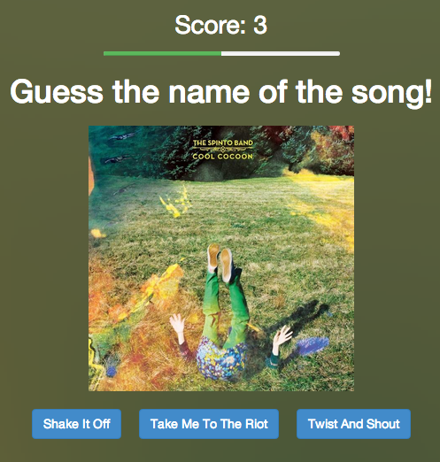

Spotify iQuiz
==============

An iQuiz-inspired project using the Spotify Web API. It uses the 30s audio previews, cover arts and user's library together with the SpeechSynthesis API. And some other buzzword I forget.

It asks questions about:
 - Artist's name
 - Track's name
 - Album's year

Demo
----
Visit [this link](http://jmperezperez.com/hacks/iquiz/)

Screenshots
-----------

Done during the [Music Hack Day 2014 in Paris](http://mhdparis.splashthat.com).

License
--------------
MIT
